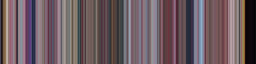
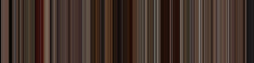

# Movie Art
Turn your favorite movies into their 1D representation, where each pixel column 
corresponds to the average color of a given frame in the movie.

## Examples
Barbie (2023)


Pulp Fiction (1994)


Test Video (512 frames transitioning from black to white)


## Installation
```sh
pip install movie_art
```

## Usage
```sh
python -m movie_art [input.mp4] [output.jpg] [width] [height]
```
*i.e.*
```sh
python -m movie_art pulp_fiction.mp4 pulp_fiction_output.jpg 512 128
```
